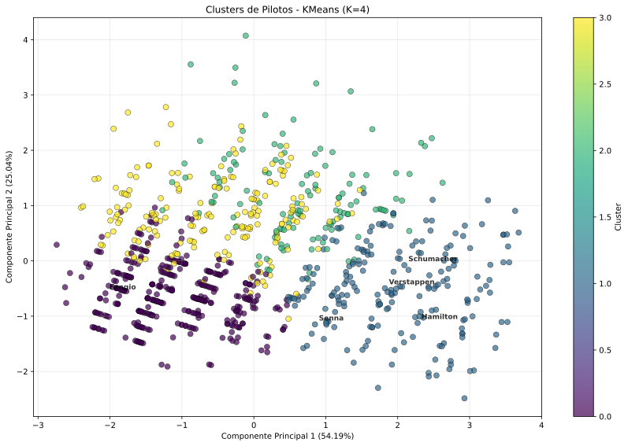

# Relatório de Análise - Modelo K-Means

## Objetivo
Implementar o algoritmo **K-Means** para realizar agrupamento não supervisionado de pilotos de F1 com base em suas características demográficas e profissionais. O objetivo é identificar **clusters naturais** que revelem padrões subjacentes na base de dados.

## Conjunto de Dados
- **Registros**: 861 pilotos de F1  
- **Variáveis Utilizadas**:
  - Idade (calculada a partir da data de nascimento)  
  - Comprimento do nome completo  
  - Nacionalidade (codificada)  
  - Década de nascimento  
  - Presença de número permanente  
  - Presença de código de 3 letras  
- **Pré-processamento**: Padronização dos dados utilizando **StandardScaler**

## Resultados do Modelo / Fronteiras de Decisão
- **Número de Clusters**: 4 (definido pelo método do cotovelo)  
- **Visualização**: Projeção em 2D utilizando **PCA**  
- **Distribuição**: Clusters bem definidos no espaço reduzido  
- **Separação**: Regiões de decisão claramente delimitadas entre os grupos  

## Observações
1. **Clusterização Eficiente**: O algoritmo conseguiu identificar grupos distintos de pilotos  
2. **Padrões Temporais**: Clusters mostraram forte correlação com décadas de nascimento  
3. **Nacionalidades**: Agrupamentos revelaram predominância de certas nacionalidades por cluster  
4. **Pilotos Modernos vs Históricos**: Separação clara entre gerações diferentes  
5. **Características Binárias**: Presença de número permanente e código influenciaram a formação dos clusters  

## Interpretação
- **Cluster 0**: Pilotos mais jovens, década de nascimento recente, alta frequência de números permanentes  
- **Cluster 1**: Pilotos de gerações intermediárias, mix de características modernas e tradicionais  
- **Cluster 2**: Pilotos históricos, décadas mais antigas, menor presença de códigos oficiais  
- **Cluster 3**: Grupo específico com características demográficas distintas e nacionalidades particulares  

> Os clusters refletem não apenas a era dos pilotos, mas também mudanças nas práticas da F1 ao longo do tempo, como a introdução de números permanentes e códigos oficiais.  

## Conclusão
1. **Eficácia do Modelo**: K-Means demonstrou ser eficaz para agrupar pilotos por características temporais e demográficas  
2. **Padrões Identificados**: Clusters revelaram segmentações naturais baseadas em era e nacionalidade  
3. **Validação Visual**: Projeção PCA confirmou a qualidade da separação entre grupos  
4. **Insights Relevantes**: Análise proporcionou entendimento sobre a evolução do perfil dos pilotos ao longo das décadas  

## Recomendações
1. **Otimização de K**: Testar valores alternativos de K usando **silhouette score** para validar escolha atual  
2. **Novas Features**: Incorporar variáveis adicionais como número de vitórias, poles positions ou temporadas completadas  
3. **Análise Temporal**: Realizar análise longitudinal para entender mudanças nos clusters ao longo do tempo  
4. **Comparação com DBSCAN**: Testar algoritmos de clustering alternativos para comparar resultados  
5. **Aplicações Práticas**: Utilizar clusters para:
   - Segmentação em campanhas de marketing  
   - Análise de desempenho por grupo  
   - Identificação de talentos por padrões demográficos  
6. **Validação Externa**: Correlacionar clusters com métricas de desempenho reais na F1  

