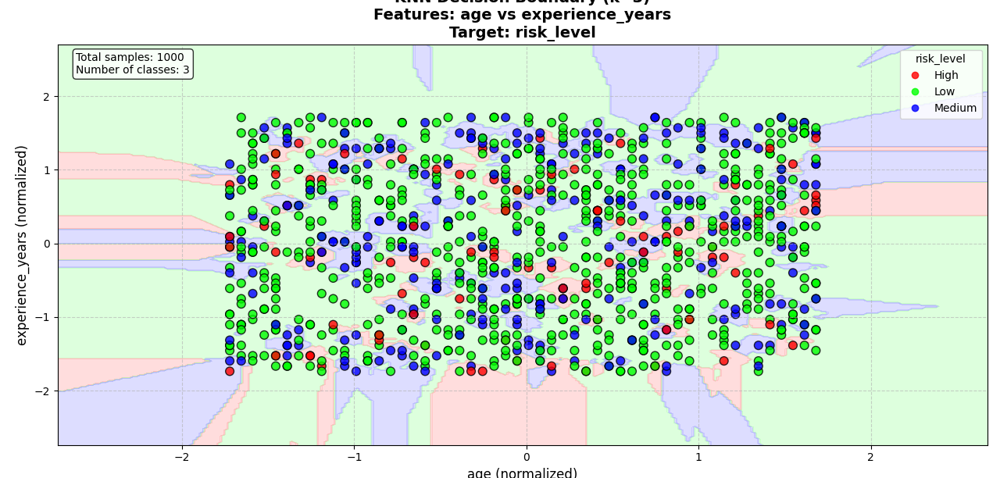

#  Relatório Final – Classificação KNN

##  Objetivo
O modelo **KNN (k-Nearest Neighbors)** foi utilizado para classificar o **nível de risco (risk_level)** com base em duas variáveis preditoras:  
- **Idade (age)** – normalizada  
- **Anos de experiência (experience_years)** – normalizada  

O objetivo foi analisar a capacidade do KNN em distinguir entre três classes de risco:  
- **High (Alto risco)** – vermelho  
- **Low (Baixo risco)** – verde  
- **Medium (Risco médio)** – azul  

---

## Conjunto de Dados
- **Total de amostras:** 1000  
- **Número de classes:** 3 (`High`, `Low`, `Medium`)  
- **Pré-processamento:**  
  - Normalização aplicada para manter as features na mesma escala.  
  - Amostras balanceadas entre as três categorias (visualmente).  

---

##  Resultados do Modelo
### Fronteiras de decisão
O gráfico mostra as **regiões de decisão do KNN** no espaço bidimensional (`age` vs `experience_years`):
- O plano foi dividido em áreas coloridas que representam a classe prevista pelo KNN.  
- Cada ponto representa uma amostra real do dataset, colorida conforme sua classe verdadeira.  

### Observações
1. **Classe predominante:** A região verde (baixo risco) ocupa a maior parte do espaço, sugerindo que o modelo frequentemente classifica amostras como "Low".  
2. **Sobreposição de classes:**  
   - As regiões azul (Medium) e vermelha (High) aparecem de forma fragmentada, indicando **dificuldade de separação clara** entre as classes.  
   - Isso sugere **alta sobreposição entre os grupos** no espaço das variáveis.  
3. **Ruído e fronteiras irregulares:**  
   - O KNN tende a criar fronteiras **não lineares e fragmentadas**, adaptando-se muito ao conjunto de treino (possível sobreajuste se `k` for muito baixo).  

---

##  Interpretação
- O modelo consegue capturar diferenças entre os níveis de risco, mas a grande quantidade de regiões pequenas e irregulares indica que os dados apresentam **forte mistura entre classes**.  
- Isso reduz a capacidade de generalização do KNN, podendo levar a **erros de classificação em novos dados**.  
- O fato da classe **"Low"** dominar sugere que ela pode estar **mais representada** ou **mais próxima das outras classes** no espaço de atributos.  

---

##  Conclusões
1. O KNN foi capaz de identificar padrões e separar classes em múltiplas regiões, mas as fronteiras resultaram muito complexas.  
2. O modelo pode estar sofrendo de **overfitting** devido a um valor de `k` baixo.  
3. Embora a classe "Low" tenha maior área de decisão, há **ambiguidade considerável** entre "High" e "Medium".  

---

##  Recomendações
1. **Testar diferentes valores de `k`** (ex.: `k=5, 7, 11`) para suavizar as fronteiras e reduzir ruído.  
2. **Aplicar validação cruzada** para avaliar o desempenho do modelo em diferentes partições do dataset.  
3. **Incluir mais variáveis preditoras** (ex.: renda, histórico financeiro, escolaridade), que podem aumentar a separabilidade entre classes.  
4. Comparar o KNN com outros modelos de classificação como **Logistic Regression, Random Forest ou SVM**, que podem lidar melhor com classes sobrepostos.  

---

 **Resumo Final:**  
O KNN conseguiu capturar padrões nos dados, mas apresentou **fronteiras fragmentadas e sobreposição significativa entre classes**, indicando a necessidade de ajustes no hiperparâmetro `k` e/ou adoção de modelos mais robustos.

